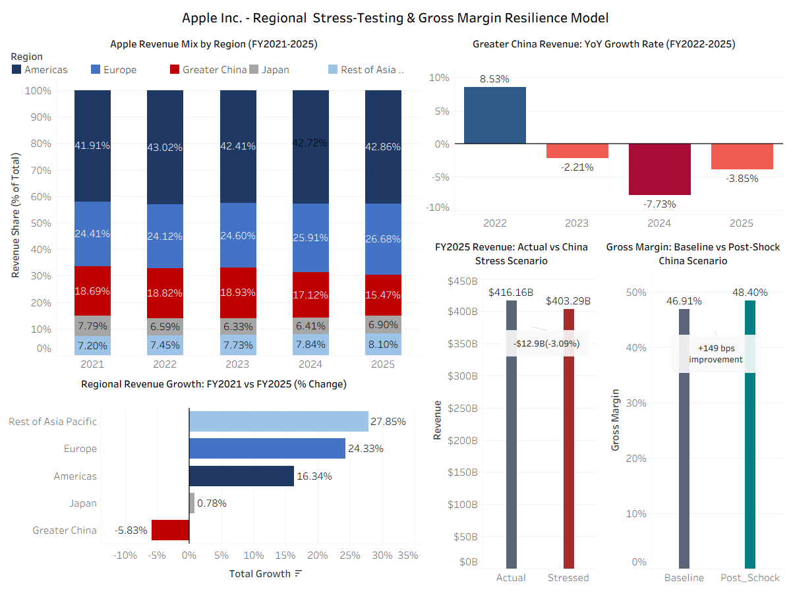
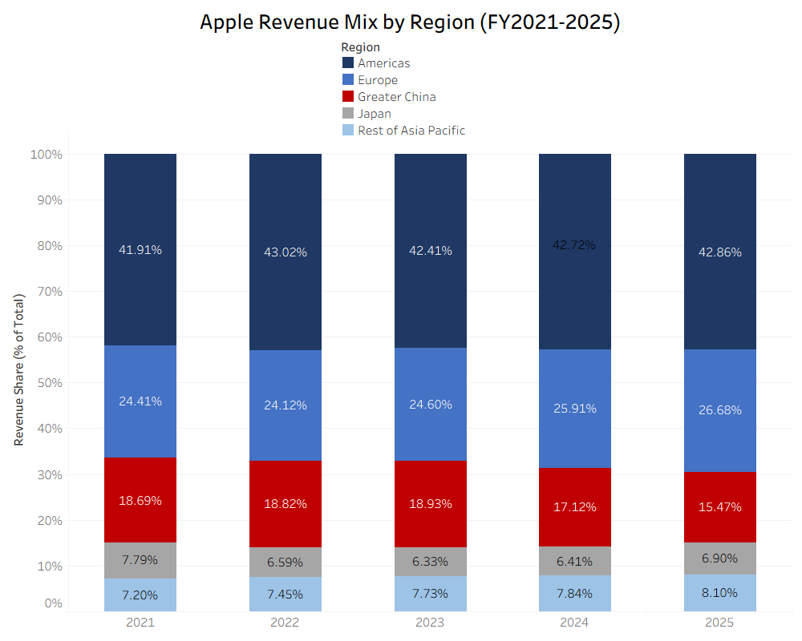
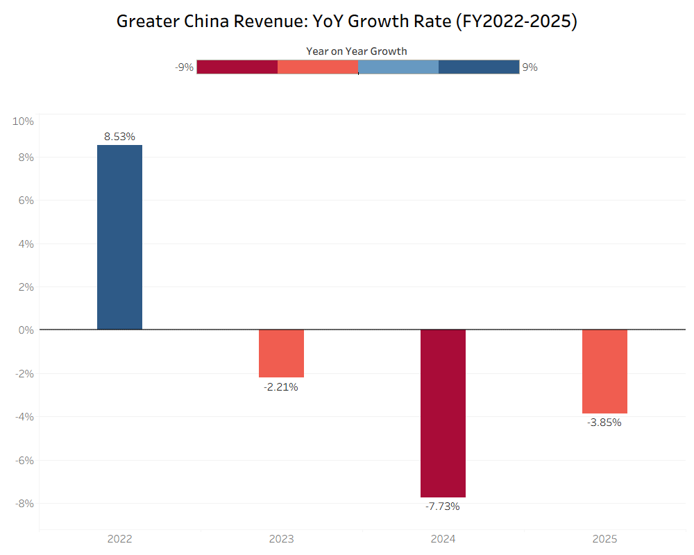
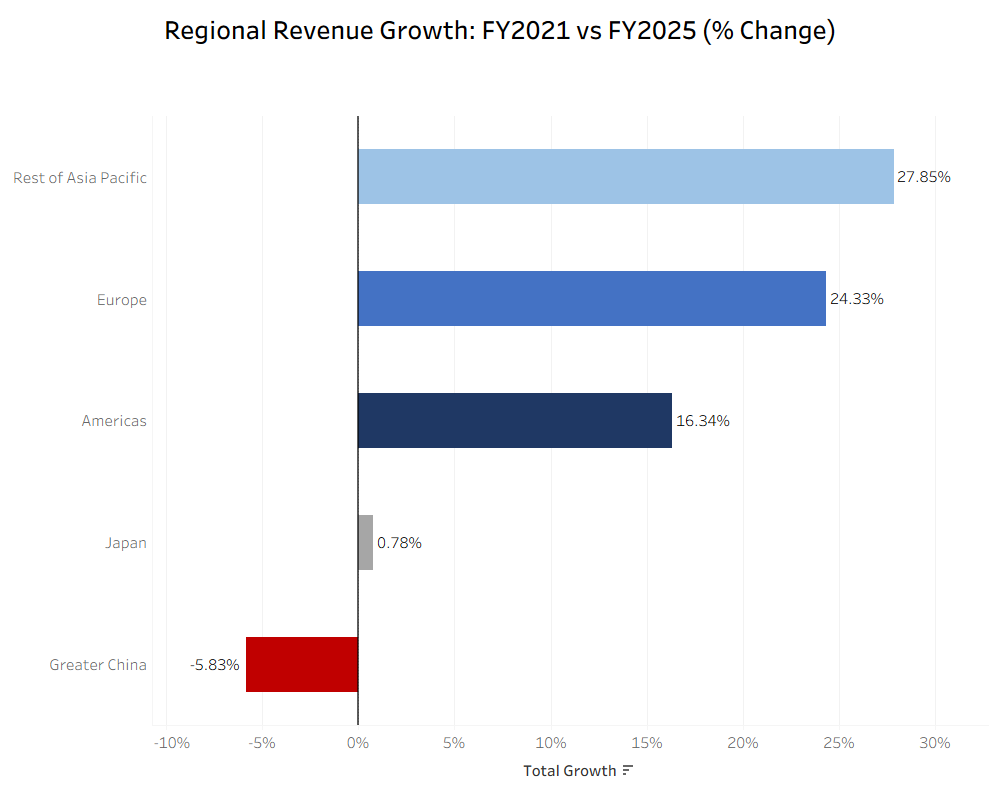
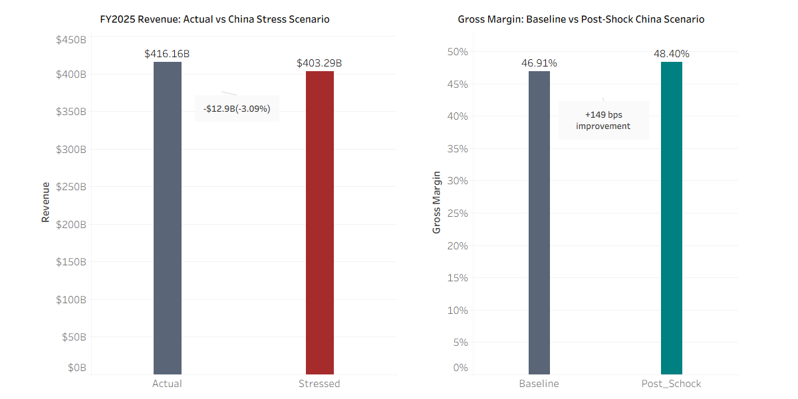

# Apple Inc. - Geographic Revenue Exposure & China Risk Analysis (FY2021-2025)

## Does Greater China Risk Threaten Apple's Services-Driven Margin Expansion ?

[](https://python.org)
[](https://cloud.com/bigquery)
[](https://cloud.google.com/bigquery/docs/reference/standard-sql)
[](https://www.tableau.com)
[](https://www.sec.gov/cgi-bin/browse-edgar)

### Project Series Context

**This is Part 2 of a three-part Apple Inc. financial analysis series.**

Part 1 - Services-Driven Revenue & Margin Analysis established that Apple's
blended gross margin expansion from 41.78% to 46.91% (FY2021-2025) is entirely
attributable to Services mix shift - not segment margin improvement. Services grew
at a 12.39% 4-year CAGR while  Products revenue peaked and declined.

Part 2 (This project) stress-tests that thesis. If Greater China - Apple's
third-largest revenue region - is in structural decline, does that represent a
material threat to the Services-driven margin story?

Part 3 - Upcoming will extend the analysis to a competitive comparison, examining
how Apple's margin structure holds up against a hardware-dependent peer with no
equivalent services business.

---

## Business Question

How significant is Apple's exposure to Greater China, how has that exposure
changed between FY2021 and FY2025, and does a decline in Greater China revenue
threaten the Services-Driven margin expansion thesis established in Part 1?

---



---

## Key Findings

| Metric | Result |
| -------- | ------- |
| Greater China revenue share FY2021 | 18.69% |
| Greater China revenue share FY2025 | 15.47% |
| Greater China absolute change FY2021-2025 | -$3.989B (-5.83%) |
| Consecutive years of YoY decline | 3 (FY2023, FY2024, FY2025) |
| Worst YoY decline | -7.73% (FY2024) |
| 20% China shock revenue impact | -$12.875B (-3.09%) |
| Baseline gross margin (FY2025) | 46.91% |
| Post-shock gross margin | 48.40% (+149bps) |
| Regions with negative growth FY2021-FY2025 | 1 of 5 (Greater China only) |

---

## The Counterintuitive Result

A simulated 20% revenue shock to Greater China - representing a severe downside
scenario - produces an estimated 149 basis point increase in Apple's blended gross
margin, from 46.91% to 48.40%.

## Why Does Margin Increase When Revenue Falls ?

The result is driven by revenue mix rather than operational improvement.
Apple's Greater China revenue base is heavily concentrated in Products revenue,
which carries a substantial lower gross margin (36.77%) than Services (75.41%). In
the simulated scenario, removing a portion of lower-margin revenue mechanically
increaases the proportion of total revenue generated by higher-margin Services,
raising the blended company-wide gross margin. This outcome should not be
interpreted as an improvement in business performance. Instead, it illustrates how
revenue composition can influence profitability metrics even when total
revenue declines.

## Interpretation

The scenario highlights an important distinction between margin performance and
business performance.

- **Revenue Impact:** A 20% reduction in Greater China revenue removes
approximately $12.88 billion from Apple's annual revenue base.

- **Margin Impact:** The same shock increases blended gross margin by
approximately 149 basis points due to a shift in revenue mix.

- **Business Impact:** Higher margins do not offset the loss of revenue scale,
market presence, or future growth opportunities.

## Strategic Implications

The results suggest that the Services-Driven margin expansion thesis identified in
Project 1 remains relatively resilient under a severe Greater China revenue shock
scenario. However, the analysis also demonstrates that margin resilience and
revenue resilience are not the same thing. While Apple's profitability profile is
partially insulated by its growing Services business, the ongoing decline in
Greater China already represents a meaningful headwind to overall revenue growth -
one that Apple's Services expansion is currently offsetting at the margin level
but not at the revenue level.

## Data Sources

| **Source** | **Usage** |
| ------------- | -------- |
| SEC EDGAR XBRL API (CIK 0000320193) | Total annual revenue |
| Apple Form 10-K FY2021-2025 | Geographic segment revenue, Products/Services segment P&L |

All figures sourced from audited filings and verified against reported 10-K totals.
Geographic segments reconcile exactly to total revenue in all five fiscal years.

---

## BigQuery Setup

**Project:** apple-geographic-analysis **Dataset:** sec_edgar_raw

## Tables

### apple_total_revenue

| **Column** | **Type** | **Description** |
| ----------- | --------- | -------------- |
| fiscal_year | INTEGER | Fiscal Year (2021-2025) |
| period_end | STRING | Period end date |
| value_usd_billions | FLOAT | Total revenue in USD Billions |
| filed | STRING | SEC filing date |
| accn | STRING | SEC accession number |
| frame | STRING | XBRL frame identifier |

### apple_geographic_revenue

| **Column** | **Type** | **Description** |
| ----------- | -------- | --------------- |
| fiscal_year | INTEGER | Fiscal Year |
| region | STRING | Americas, Europe, Greater China, Japan, Rest of Asia Pacific |
| revenue_usd_billions | FLOAT | Regional revenue in USD Billions |

### apple_segment_revenue

| **Column** | **Type** | **Description** |
| ----------- | -------- | --------------- |
| fiscal_year | INTEGER | Fiscal Year |
| segment | STRING | Products or Services |
| revenue_usd_billions | FLOAT | Segment revenue in USD Billions |
| gross_profit_usd_billions | FLOAT | Segment gross profit in USD Billions |
| gross_margin_pct | FLOAT | Segment gross margin percentage |

## SQL Analysis

### Query 01 - Geographic Revenue Mix by Year

**File:** queries/01_geographic_mix.sql

Window function calculating each region's percentage share of total revenue per
fiscal year using SUM() OVER (PARTITION BY fiscal_year).

**Result:**

| **Region** | **FY2021** | **FY2022** | **FY2023** | **FY2024** | **FY2025** |
| ----------- | ---------- | ---------- | ---------- | ---------- | ---------- |
| Americas | 41.91% | 43.02% | 42.41% | 42.72% | 42.86% |
| Europe | 24.41% | 24.12% | 24.60% | 25.91% | 26.68% |
| Greater China | 18.69% | 18.82% | 18.93% | 17.12% | 15.47% |
| Japan | 7.79% | 6.59% | 6.33% | 6.41% | 6.90% |
| Rest of Asia Pacific | 7.20% | 7.45% | 7.73% | 7.84% | 8.10% |



### Query 02 - Greater China YoY Growth Trend

**File:** queries/02_china_trend.sql

CTE with LAG() window function to calculate year-over-year growth rate for Greater
China specifically.

**Results:**

| **Fiscal Year** | **China Revenue (B)** | **YoY Growth** |
| ---------------- | --------------------- | -------------- |
| 2021 | 68.366 | - |
| 2022 | 74.200 | +8.53% |
| 2023 | 72.559 | -2.21% |
| 2024 | 66.952 | -7.73% |
| 2025 | 64.377 | -3.85% |

Three consecutive years of decline. Revenue contracted $9.823B from the FY2022
peak of $74.2B.



### Query 03 - Regional Revenue Growth: FY2021 VS FY2025

**File:** queries/03_regional_growth_comparison.sql

CTE using CASE WHEN pivot to extract FY2021 AND FY2025 revenue per region,
calculating absolute and percentage growth over the full period.

**Results:**

| **Region** | **FY2021 ($B)** | **FY2025 ($B)** | **Absolute Growth ($B)** | **% Growth** |
| ----------- | --------------- | --------------- | ------------------------ | ------------ |
| Rest of Asia Pacific | 26.356 | 33.696 | +7.340 | +27.85% |
| Europe | 89.307 | 111.032 | +21.725 | +24.33% |
| Americas | 153.306 | 178.353 | + 25.047 | +16.34% |
| Japan | 28.482 | 28.703 | +0.221 | +0.78% |
| Greater China | 68.366 | 64.377 | -3.989 | -5.83% |

Greater China is the only region to decline over the full five-year period.



---

### Query 04 - China Shock Scenario (20% Revenue Haircut)

**File:** queries/04_china_risk_scenario.sql

Two CTEs: geo_shock applies a 20% revenue reduction to Greater China using CASE
WHEN, segments_2025 pulls baseline gross profit from the segment table. A CROSS
JOIN combines the geographic stress-test scenario with FY2025 segment profitability
data to estimate the impact on total revenue and blended gross margin.

**Result:**

| **Metric** | **Value** |
| ----------- | --------- |
| Actual FY2025 Revenue | $416.161B |
| Shocked Revenue (-20% China) | $403.286B |
| Net Revenue Impact | -$12.87B (-3.09%) |
| Baseline Gross Margin | 46.91% |
| Post-Shock Gross Margin | 48.40% |
| Margin Change | +149bps |



---

### Python Data Pipeline

**File:** scripts/load_apple_data.py

End-to-end pipeline for SEC EDGAR API extraction and BigQuery loading:

1. Fetches Apple's revenue data from SEC EDGAR XBRL API using CIK 0000320193
2. Filters for Form 10-K annual filings (form = "10-K", fp = "FY")
3. Extracts fiscal year, period end, value, and filing metadata
4. Deduplicates on fiscal year, keeping the most recent filing
5. Filters for FY2021 and later
6. Loads into BigQuery with explicit schema definition using WRITE_TRUNCATE

**Libraries:** requests, json, pandas, google-cloud-bigquery

## Repository Structure

```text

apple-geographic-analysis/
├── data/
│   └── processed/
├── queries/
│   ├── 01_geographic_mix.sql
│   ├── 02_china_trend.sql
│   ├── 03_regional_growth_comparison.sql
│   └── 04_china_risk_scenario.sql
├── scripts/
│   └── load_apple_data.py
├── visualizations/
│   ├── 01_geographic_mix_dash.png
│   ├── 02_china_trend_dash.png
│   ├── 03_regional_growth_comp_dash.png
│   ├── 04_mixed_dashboard.png
│   └── overview_dashboard.png
└── README.md 
```

## Skills Demonstrated

- Financial Statement Analysis
- Revenue Concentration Analysis
- Scenario Modelling and Stress Testing
- SQL Window Functions
- Common Table Expressions (CTEs)
- Business Intelligence Dashboards
- BigQuery data warehousing
- Data Storytelling

## Tools Used

| **Tool** | **Purpose** |
| --------- | ----------- |
| Python (requests, pandas) | SEC EDGAR API data extraction |
| Google BigQuery | Cloud data warehouse and SQL execution |
| SQL (CTEs, Window Functions, CROSS JOIN) | Geographic mix, trend, and scenario analysis |
| Tableau | Dashboard visualization |
| SEC EDGAR XBRL API | Primary data source |
| GitHub | Version control and portfolio presentation |

## Key SQL Techniques

- SUM() OVER (PARTITION BY) - revenue share calculation per year
- LAG() - year-over-year growth rate calculation
- CASE WHEN pivot inside CTE - multi-year regional comparison
- CROSS JOIN - combining geo shock and segment margin CTEs for scenario output

## Conclusion

Greater China remains one of Apple Inc.'s most important markets, but the region's
contribution to total revenue has declined from 18.69% in FY2021 to 15.47% in
FY2025. Over the same period, Greater China became the only geographic segment to
record a net revenue decline, including three consecutive years of contraction
from FY2023 through FY2025. To evaluate whether this trend threatens Apple's
Services-Driven margin expansion thesis, I performed a stress-test scenario
assuming a 20% reduction in Greater China revenue. The model estimates a $12.88
billion reduction in annual revenue, equivalent to approximately 3.1% of FY2025
sales. Despite this revenue loss, Apple's blended gross margin increases from 46.
91% to 48.40%. This outcome is not the result of improved operating performance,
but rather a shift in revenue composition. Because Greater China is primarily
associated with lower-margin Product sales, the reduction increases the relative
contribution of higher-margin Services revenue. The analysis suggests that Greater
China represents a meaningful revenue concentration risk, but not a material
threat to the margin expansion thesis established in Project 1. While continued
weakness in China would negatively affect revenue growth and scale, Apple's
increasing reliance on Services provides a degree of insulation at the
profitability level. The primary conclusion is therefore that China risk threatens
revenue growth more than it threatens margin expansion.

---

## Limitations

- The 20% shock scenario assumes no management response - no cost reduction, no
volume replacement in other regions
- Segment margin assumptions are held at FY2025 actuals and not projected forward
- Geographic revenue data sourced from 10-K figures; sub-regional breakdown not
available
- Analysis based on reported financials only; does not incorporate supply chain or
operational exposure to China

---

## Author

**Troy Sithole** Aspiring Financial Analyst | Python·SQL·BigQuery·Tableau·SEC EDGAR

[LinkedIn](https://www.linkedin.com/in/troysithole) · [GitHub](https://github.com/troy-sithole) · [Part 1 - Services-Driven Revenue & Margin Analysis](https://github.com/troy-sithole/apple-financial-analysis)
